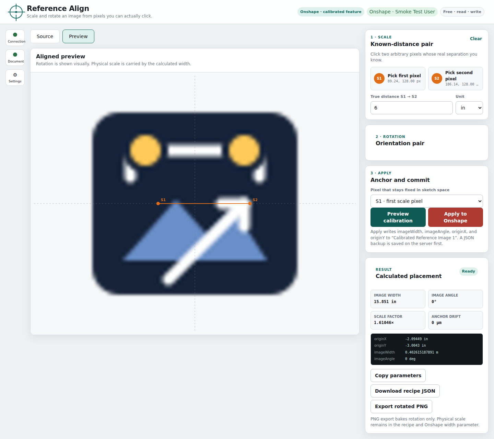

# Reference Align for Onshape

[](https://github.com/thereprocase/onshape-reference-align/actions/workflows/ci.yml)
[](LICENSE)

Scale and rotate a reference image using distances and directions you know.

## Get the desktop app

Download from [GitHub Releases](https://github.com/thereprocase/onshape-reference-align/releases).
Native Windows, Linux, Apple Silicon Mac and Intel Mac builds pass automated
tests and packaged-app smoke checks. Read the release notes for verification
details and remaining first-launch/user-testing limits.

Choose the ZIP for Windows, Linux, Mac Apple Silicon, or Mac Intel under
**Assets**. The automatically generated **Source code** downloads are for
developers, not the ready-to-run app. Extract the whole ZIP, open
**START-HERE.html**, and follow its launcher and Onshape connection steps.
No Node installation or website setup is needed.



*Demonstration using the app icon and a local test account; no real Onshape document is shown.*

## How calibration works

1. Pick two **arbitrary pixels** `S1 → S2`.
2. Enter their true separation.
3. Use the same pair, or pick `R1 → R2`, to define rotation.
4. Make that line horizontal, vertical, nearest-axis, or any angle.
5. Keep `S1`, `S2`, `R1`, `R2`, or the image center fixed while the image moves.
6. Preview, then write the calculated placement to Onshape.

## What this package contains

- A dependency-free Node 22 web server.
- A pixel-accurate browser picker with zoom, pan, loupe, subpixel coordinates, separate scale/rotation pairs, and an aligned preview.
- A supported Onshape write path through the included **Calibrated Reference Image** FeatureScript.
- OAuth, signed API-key, Basic local-test API-key, and bearer-token server authentication modes.
- JSON backup before every Onshape feature update.
- A deliberately gated experimental adapter for Onshape's native `Insert image` sketch entity.
- Unit tests for scale, rotation, anchoring, units, feature discovery, and feature updates.

## Important Onshape boundary

Onshape does not expose individual raster pixels as sketch geometry. Reference Align therefore renders the image **in its own browser page**, where you click the pixels, and then writes the resulting width, angle, and origin to the Part Studio. The standalone app does not require an Onshape extension.

The supported integration uses `featurescript/ReferenceImage.fs`. Directly rewriting a native `Insert image` entity depends on Onshape's internal serialized sketch format and remains disabled by default.

## Start using the app — no developer tools needed

Download your platform’s ZIP and extract the whole folder (**Extract All…** on
Windows). Open **START-REFERENCE-ALIGN.cmd** (Windows),
**START-REFERENCE-ALIGN.command** (macOS), or **START-REFERENCE-ALIGN.sh** (Linux).
Keep its app window open while you work in the browser.
Open **START-HERE.html** in the extracted folder for the complete
offline guide. The [project website](https://thereprocase.github.io/onshape-reference-align/)
provides the browser-readable guide; the HTML file
in the source tree is its source, not a rendered GitHub documentation page.

The connection wizard guides you through creating an Onshape API key and
entering it in the app. You do not need Node, a terminal, credential-file edits,
or an Onshape extension registration for the standalone app.

Use the public [release page](https://github.com/thereprocase/onshape-reference-align/releases)
for downloads and checksums. macOS packages are built and smoke-tested natively
for both Apple Silicon and Intel. An unaided real-person first-launch test
remains outstanding; automated checks do not validate desktop trust prompts.
See
[`docs/DISTRIBUTION.md`](docs/DISTRIBUTION.md) for the SmartScreen/Gatekeeper
prompt an unsigned binary shows the first time, how to verify the download
against `SHA256SUMS`, and where its configuration and backups live on each OS.

## Developer quickstart (from source)

Install Node.js 22 or newer, then open a terminal in the extracted project
directory containing `package.json`:

```bash
npm start
```

This opens your browser to the app; pass `--no-open` to skip that
(`npm start -- --no-open`).

Use the local address printed at startup (normally `http://127.0.0.1:8787`), then:

1. **Set up Onshape** — press the badge at the top and paste an API key.
2. **Paste your Part Studio URL** into the Onshape target card.
3. **Choose an image source** — load a local image, or choose an existing image
   tab in the Document panel. A fresh document needs a local image to upload.
4. **Install into this document** — choose its Plane, then install. This adds
   the Calibrated Reference Image feature and points it at the chosen image.
5. **Load selected Onshape image** if the source is not already loaded, then
   pick the pixels, preview and apply.

Steps 1 and 4 are one-time per key and per document. Nothing is written to
Onshape without an explicit press, and the app asks first unless you turn that
off.

## Developer checks and source launch

```bash
npm test
npm start
```

`npm start` opens your browser automatically; pass `--no-open` to skip that.

Open:

```text
http://127.0.0.1:8787
```

No credentials are required for standalone calibration: load a local PNG/JPEG/WebP, pick the points, and download the recipe JSON or copy the calculated FeatureScript parameters.

To write the result into a Part Studio, connect Onshape first. The Connection panel walks through it:

1. Press **Set up Onshape** (the badge at the top of the page).
2. Follow the four steps to create an API key at [dev-portal.onshape.com/keys](https://dev-portal.onshape.com/keys), with **Read documents** and **Write documents** ticked.
3. Paste the access and secret key, press **Test connection**, then **Save and continue**. The key is written to the server's configuration file and takes effect immediately — no restart.
4. Paste your Onshape Part Studio URL into the Onshape target card.

This all runs on the machine that started the server; the wizard refuses to run from any other computer, even on the same network. Editing the env file by hand (see below) remains the headless alternative for a server you cannot reach a browser on, or for scripted setup.

Either path writes to the same file: `<project root>/.env` if one already exists there (`cp .env.example .env` still works for that), otherwise a per-user configuration directory — `%APPDATA%\onshape-reference-align\.env` on Windows, `~/Library/Application Support/onshape-reference-align/.env` on macOS, `$XDG_CONFIG_HOME/onshape-reference-align/.env` (or `~/.config/...`) on Linux. The resolved path is printed once at startup (`Config: <path> (<source>)`) and shown in the wizard. On Windows the file's mode bits are not the real protection — the containing directory's ACL is; see [`docs/ARCHITECTURE.md`](docs/ARCHITECTURE.md).

## Install the Onshape feature

Load a document in the Onshape target card and the panel tells you what it
already has. If the feature is not there, pick an image tab — or the image you
have loaded, which is uploaded for you — and press **Install into this
document**. That creates a Feature Studio holding
`featurescript/ReferenceImage.fs`, adds a **Calibrated Reference Image**
instance on the selected plane (Top by default), and selects it as the target.

The **Plane** picker lists Top, Front, Right, user-created planes and **Same
plane as** each sketch. Unresolved planes and features that occur after the
selected image are unavailable. To move an installed calibrated image, use
its **Plane** controls: the app backs up the feature, changes only its plane
parameter and checks Onshape's regeneration result.

Pressing it again does nothing: a document that already has the feature is
reported as such, not installed over.

Once installed, **Upload the local image and use it** sends the image loaded
in the browser to Onshape and points the selected feature at it. It always
uses the image loaded locally, never whatever is chosen in the picker above
it. Uploads are capped at 25 MB and are typed from the file's own bytes, not
from what the browser calls them; set `MAX_IMAGE_UPLOAD_BYTES` in the
configuration file to change the cap.

### Workspace layout

Connection, Document and Settings open from the left rail. The center stage
switches between **Source** and **Preview**; calibration tools stay on the
right. On narrow screens the rail becomes a top bar and tools stack below the
image. Rotation and Result can collapse independently. Keyboard users can
open a panel from its button and close it with Escape, which returns focus.

### The image is now in the document twice

If the document already had the image inserted in a sketch, applying a
calibration leaves the same picture on screen twice. The result card says so
and offers to suppress the sketch:

> "Sketch 1" also shows this image. Suppress it?

Suppressing hides the sketch in Onshape. Nothing is deleted, and the target
card carries an **Unsuppress this sketch** button for as long as it is hidden.
If the sketch holds anything besides the image, the offer says how much —
hiding it hides that too, including anything built on top of it.

The offer only appears when the panel has evidence. Two images bound to the
same file in the document are named as duplicates outright; a matching shape
is offered as a likely one; anything that plainly disagrees is not offered at
all.

### Installing it by hand

Still supported, and the right path for a document the server cannot write to:

1. Create a Feature Studio in an Onshape document.
2. Paste the contents of `featurescript/ReferenceImage.fs` and commit it.
3. In a Part Studio, add or select **Calibrated Reference Image**.
4. Choose the image and planar face/plane. Its four placement values are:
   - `Image width`
   - `Image angle`
   - `Origin X`
   - `Origin Y`
5. Configure Reference Align authentication and the right-panel extension as described in [`docs/ONSHAPE_SETUP.md`](docs/ONSHAPE_SETUP.md).

A hand-installed Feature Studio is recognised as long as it still carries the
`// reference-align-feature: 1` marker line near the top of the file.

The image feature treats `Origin X/Y` as the **lower-left image corner** in the selected plane's canonical sketch coordinates. `Image angle` measures counterclockwise from sketch +X.

## Fast local Onshape test with an API key

Create an API key with document read/write access, then place it only in `.env`. `auto` uses signed requests; set `api-key` explicitly for the simplest local Basic-auth test:

```dotenv
ONSHAPE_AUTH=api-key
ONSHAPE_ACCESS_KEY=YOUR_ACCESS_KEY
ONSHAPE_SECRET_KEY=YOUR_SECRET_KEY
```

Start the server, open `http://127.0.0.1:8787/`, and paste the Part Studio's browser address into the Onshape URL box. Equivalently, build the context URL by hand:

```text
http://127.0.0.1:8787/?documentId=DOCUMENT_ID&workspaceId=WORKSPACE_ID&elementId=ELEMENT_ID
```

Select the calibrated image feature, load its image through the panel when available—or load the same local source image—and apply the calibration.

For an internal/private service, switch to Onshape's HMAC request-signature mode without changing the key pair:

```dotenv
ONSHAPE_AUTH=api-key-signature
```

That mode generates a fresh date and nonce for every request and re-signs Onshape redirects.

## Register it as an Onshape right-panel extension

For a hosted HTTPS deployment, use this action URL:

```text
https://YOUR-HOST/?documentId={$documentId}&workspaceId={$workspaceOrVersionId}&elementId={$elementId}
```

Register it under **Developer → Extensions** with:

- Location: `Element right panel`
- Context: `Inside part studio`
- Document permissions: read and write

Use OAuth for a shared/team app. For a tightly controlled private service, use signed API-key requests; reserve Basic API-key authorization for local testing.

## Calibration model

For image width `P_w`, height `P_h`, and a browser pixel `(p_x,p_y)`:

```text
u = p_x / P_w
v = 1 - p_y / P_h
local = (W·u, W·v/(P_w/P_h))
world = origin + rotate(local, θ)
```

For scale pair `S1,S2` and true distance `D`:

```text
W_new = D / length(local(S2,W=1) - local(S1,W=1))
```

For orientation pair local angle `α` and desired world/sketch angle `β`:

```text
θ_new = β - α
```

Finally, the app solves a new origin so the selected anchor pixel keeps exactly the same sketch-space location.

See [`docs/ARCHITECTURE.md`](docs/ARCHITECTURE.md) for coordinate conventions and API behavior.

## What the app is allowed to do

Two separate things decide whether a write happens.

**What your API key can do.** The server reads the key's permissions from
Onshape and shows them in the header badge, next to your plan — for example
`Free · read · write`. A key without Write documents cannot install a feature
or apply a calibration, and the app says so on the button instead of letting
you press it and collecting an error. Permission bits the app does not
recognise are shown rather than ignored.

**What you have switched on.** Press **Settings** in the left rail (the top
bar on narrow screens) to open **What this app is allowed to do**. Each switch sits above one line saying what your
key can do for that action. The switches are:

| Switch | Default | Controls |
| --- | --- | --- |
| Install the Reference Image feature | on | Adding the feature to a Part Studio |
| Upload images | on | Sending an image file to your document |
| Create scratch documents | on | Reserved for the `scripts/live-verify-*.mjs` command-line scripts; this page does not create documents yet |
| Suppress features | on | Suppressing and unsuppressing a feature |
| Confirm before every write | on | Asking first, every time |

The settings live in `settings.json` beside your configuration file, and they
can only be changed from a browser on the computer running the server. They
hold no credentials.

Deleting is never required. This app treats cleanup as optional and skips it
when the key cannot delete.

To see the same information from a terminal:

```bash
node scripts/inspect-capabilities.mjs --yes
```

That makes one read-only request and writes nothing.

## Safety and reversibility

- Every write starts from a freshly fetched feature list.
- Every write creates a timestamped JSON backup in `BACKUP_DIR`.
- Apply works only in a workspace, never a version or microversion.
- Native sketch-image writes stay off unless `ENABLE_NATIVE_IMAGE_WRITE=true`.
- The browser never receives API keys, OAuth client secrets, or bearer tokens,
  and never receives the account email Onshape returns with the session info.
- Every write is checked twice before it is attempted: against the key's own
  permissions, and against your settings.
- Every write response is checked for Onshape's own `featureStatus`. HTTP 200
  is not taken as success: Onshape stores an unresolvable image reference
  without complaint and reports the feature as `ERROR`.
- Uploaded files are identified by their leading bytes, not by the
  `Content-Type` the browser sent.

## Verification status

`npm run check` exercises geometry, request signing, UI contracts, serialized feature updates, and local HTTP workflows against offline Onshape fixtures. Recorded public-scratch-document checks verified install/upload/rebind, plane changes, separate scale/rotation Apply and a healthy native-image suppression round trip. Chromium checks cover setup, picking and preview. See [`docs/VERIFICATION.md`](docs/VERIFICATION.md) for evidence and scope; final combined-tree checks and executable builds are recorded separately. Use a disposable document for live testing.

## Project layout

```text
featurescript/ReferenceImage.fs  Supported custom image feature
public/                          Right-panel and standalone UI
src/                             Geometry, units, auth, and Onshape adapters
test/                            Node test suite
docs/                            Setup, architecture, and verification notes
server.mjs                       HTTP/API server
```

## License

MIT. See [`LICENSE`](LICENSE).
